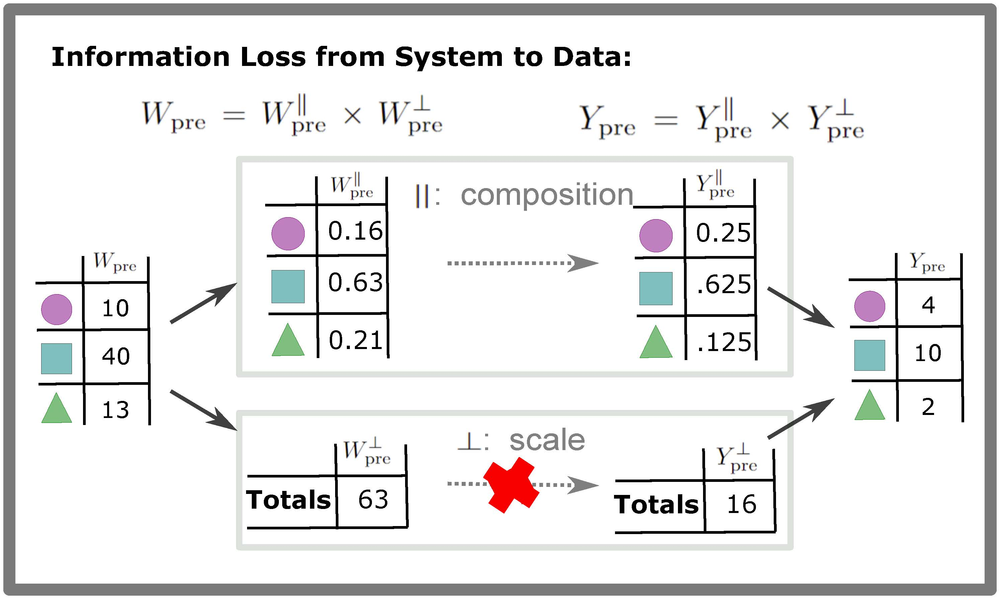
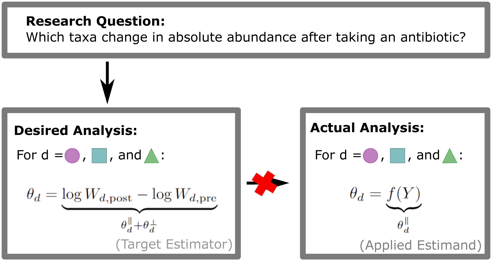
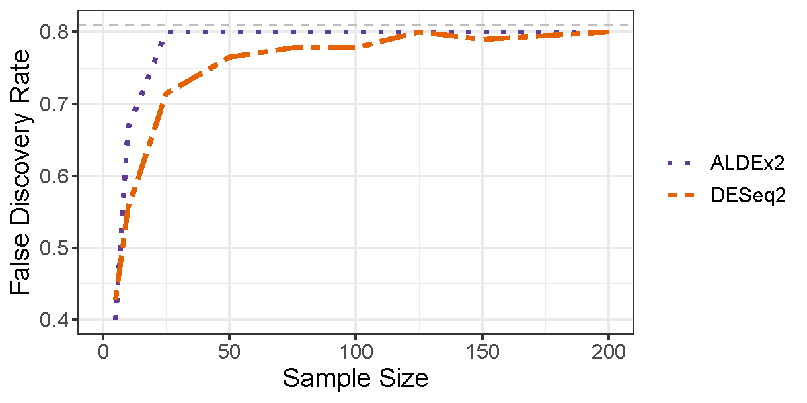
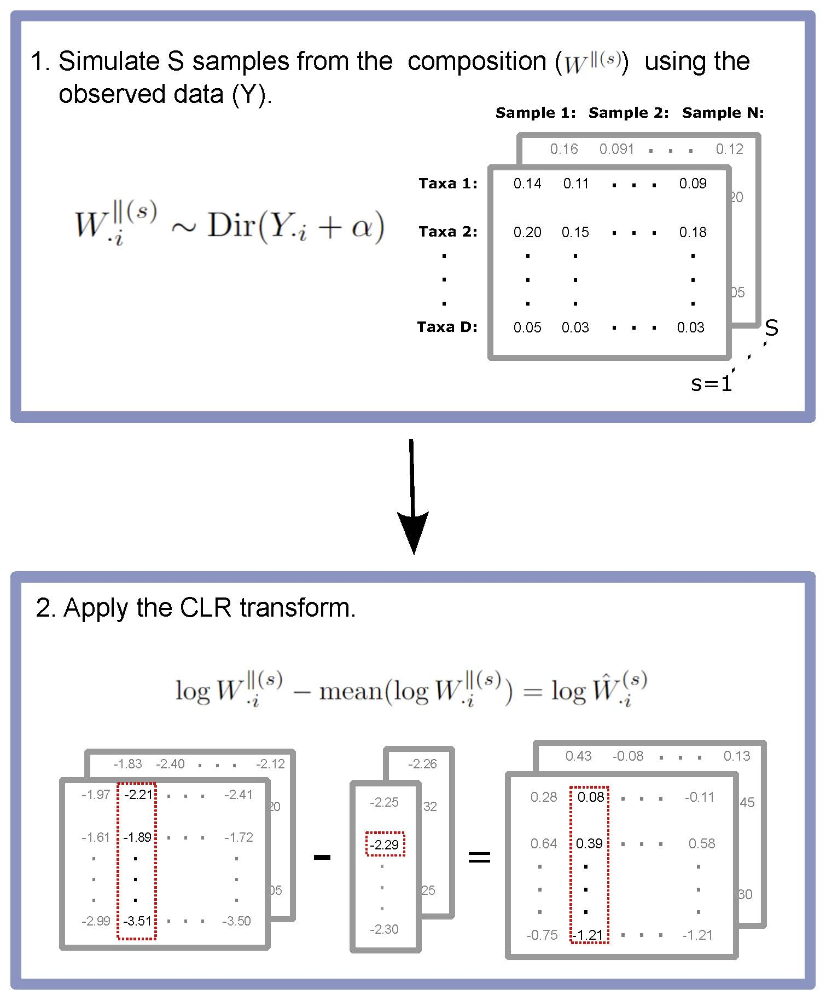
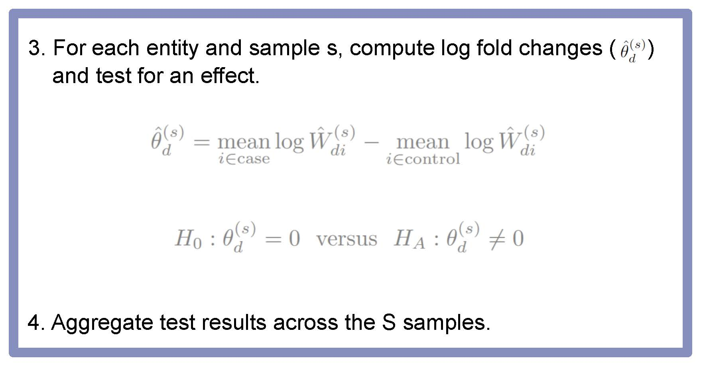
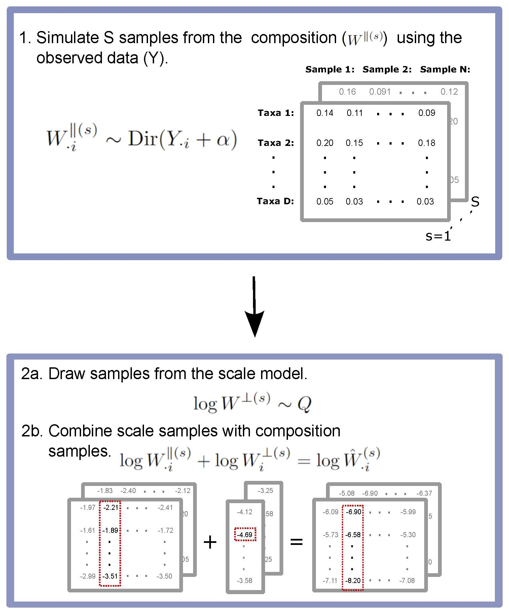

```{r setup, include=FALSE}
knitr::opts_chunk$set(echo = FALSE)
library(kableExtra)
```


## Setup and Code Availability

* The newest version of ALDEx2 is necessary for this workshop (version 1.35.0, updated October 2023) . Available on Bioconductor or GitHub (https://github.com/ggloor/ALDEx_bioc).

```{r, echo = TRUE, eval = FALSE}
##To install from Bioconductor:
BiocManager::install("ALDEx2")

##To install from GitHub:
devtools::install_github("ggloor/ALDEx_bioc")
```

* All workshop materials can be found on GitHub (https://github.com/michellepistner/dawg_workshop).


## Problem Set-Up

Consider a simple study of the microbiome pre/post antibiotic administration.

  - Research question: Which taxa change in absolute abundance after taking an antibiotic?
  - How do we analyze this data to answer the question?

## Sequence Count Data as a Sample

```{r, echo=FALSE, out.width = '75%', fig.align='center'}
knitr::include_graphics("figures/sampling-loss.jpg")
```

## Gap between Data and System

```{r, echo=FALSE, out.width = '100%', fig.align='center'}

```

## Implications for Analysis

```{r, echo=FALSE, out.width = '100%', align = "center"}

```

## Options for Analysis

1. Use an existing method for differential abundance.
    - ALDEx2, DESeq2, edgeR, etc.
    - These methods rely on *normalizations*.

2. Reframe the question (CoDA).
    - Data are compositional.
    - Differential abundance cannot be done rigorously.
    
## Problems with these Options

- **Option 1:** Disconnect between question and normalization can lead to elevated type-I and type-II errors. <span style="color: lightgrey;">Why?</span>

```{r, echo=FALSE, out.width = '70%', fig.align='center'}

```

- **Option 2:** Can't answer many research questions. 

## New Option: Scale Reliant Inference

A middle ground approach:

- $Y$ is a measurement of the underlying system $W$.

- Desired quantity depends on $W$ (i.e., $\theta = f(W)$). However, $W$ depends on both the composition and system scale, i.e.:

$$W_{dn} = W_{dn}^\parallel W_n^\perp$$
$$W_n^\perp = \sum_{d=1}^D W_{dn}$$

## Scale Simulation Random Variables

1. Draw samples of $W^{\parallel}$ from a measurement model (can depend on $Y$).
2. Draw samples of $W^{\perp}$ from a scale model (can depend on $W^{\parallel}$).
3. Calculate samples of $\theta = f(W^\parallel, W^\perp)$.

# Adding Scale to ALDEx2

## ALDEx2 Software Suite

```{r, echo=FALSE, out.width = '50%', fig.align='center'}

```

## ALDEx2 Software Suite

```{r, echo=FALSE, out.width = '80%', fig.align='center'}

```

## Unacknowledged Bias within ALDEx2

Step 2 places an assumption on system scale.

- Consider that $\log W_{dn} = \log W_{dn}^\parallel + \log W_n^\perp$.

- We can show that the CLR transformation corresponds to the assumption:

$$\log W_n^\perp = - \mathrm{mean}(\log \hat{W}_{\cdot n}^\parallel).$$


## Moving Past Normalizations to Scale within ALDEx2

```{r, echo=FALSE, out.width = '45%', fig.align='center'}

```


## Scale Models in ALDEx2

Normalizations are replaced by a scale model:

$$\log W_n^\perp \sim Q$$

There are no restrictions on $Q$, although there are some helpful options:

1. Based on normalizations.
2. Based on biological knowledge.
3. Based on outside measurements.

# New Additions to ALDEx2

## Data Simulation

We have:

  - 2 conditions (pre- and post- administration) with 50 samples per condition.
  - 20 taxa: 4 change between conditions, 16 don't.
  
To simulate the data, we:

  1. Use the Poisson distribution to sample true abundances ($W$).
  2. Use Multinomial sampling to sub-sample $W$ to an arbitrary sequencing depth ($Y$).
  
Simulation functions can be found in scripts > data_simulation.R.

## Reading in the Simulated Data

```{r, echo= TRUE, message = FALSE, warning = FALSE}
###Analysis file for simulated data
library(ALDEx2)
library(tidyverse)
library(ggplot2)
library(ggpattern)
library(cowplot)

set.seed(12345)
setwd('..')
##Reading in data (see "data_simulation.R" for details.)
rdat <- read.csv(file.path("data/simulation/sim_seq_dat.csv"))
flow_data <- read.csv(file.path("data/simulation/sim_flow_dat.csv"))
```


## Inspecting the Data
```{r, echo=TRUE}
## "Y" represents the OTU table
Y <- t(rdat[,-1])
Y[1:4,1:4]

##Vector denoting whether samples was in
##pre- or post- antibiotic condition.
conds <- as.character(rdat[,1])
conds[c(1:4,51:55)]
```

## Effects of Unacknowledged Bias

```{r, echo = TRUE, message = FALSE,  tidy=TRUE, tidy.opts=list(width.cutoff=50), results = "asis"}
## Fitting and analyzing the original ALDEx2 model
mod.base <- aldex(Y, conds)
print(row.names(mod.base %>% filter(we.eBH < 0.05)))
```

## Including scale through `gamma`.

- The argument `gamma` has been added to the `aldex` and `aldex.clr` function.

- `gamma` can either be a single numeric or a matrix.
    1. Single numeric: controls the noise on the default scale model.
    2. Matrix: A $N \times S$ matrix of samples of $W$.
    

## Option 1: Default Scale Model
The default scale model is based on errors in the CLR normalization.

$$\log \hat{W}_{n}^{\perp(s)} = - \mathrm{mean} \left(\log \hat{W}^{\parallel (s)}_{\cdot n}\right) + \Lambda^\perp x_{n}$$
$$\Lambda^\perp  \sim \ N(0, \gamma^2).$$

## Decoding the Default Scale Model

If $\gamma \rightarrow 0$, the default scale model is equal to the CLR, i.e., 

$$\log \hat{W}_{n}^{\perp(s)} = - \mathrm{mean} \left(\log \hat{W}^{\parallel (s)}_{\cdot n}\right).$$

Thus, the noise component controls deviations from this assumption.

## Decoding the Default Scale Model

$$\log \hat{W}_{n}^{\perp(s)} = - \mathrm{mean} \left(\log \hat{W}^{\parallel (s)}_{\cdot n}\right) + \Lambda^\perp x_{n}$$
$$\Lambda^\perp  \sim \ N(0, \gamma^2).$$

- By the empirical rule, 95% of samples from $\Lambda^\perp$ fall within $2 \gamma$ of zero.
- This implies that, with 95% certainty, the scales between conditions fall within the range ($2^{\hat{\theta}^\perp-2 \gamma}, 2^{\hat{\theta}^\perp+2 \gamma}$) where $\hat{\theta}^\perp$ is what is implied by the CLR.

## Re-creating the CLR with `gamma`.

We can recreate the CLR by letting $\gamma \rightarrow 0$.

```{r, echo = TRUE, message = FALSE, out.width="60%", fig.align='center'}
mod.clr <- aldex(Y, conds, gamma = 1e-3)
plot(mod.base$effect, mod.clr$effect, xlab = "Original ALDEx2 
  Effect Size", ylab = "CLR Scale Model Effect Size")
abline(a=0,b=1, col = "red", lty = "dashed")
```


## How to Choose $\gamma$

We recommend a value of $\gamma = 0.50$.

- This corresponds the the assumption that 95\% of the scale samples are within $(0.5, 2)$ of the geometric mean.
- In words, 95% of the scale samples are within half or double of the amount implied by the normalization.
- **Any value of $\gamma > 0$ is an improvement over the status quo!!**

## Option 1: Examples (Some Noise)

```{r, echo = TRUE, message = FALSE}
## Adding noise via the default scale model
mod.ss <- aldex(Y, conds, gamma = .25)
mod.ss %>% filter(we.eBH < 0.05)

```

<p style="text-align: center;">**3 of 20 taxa (all true positives) are significant!**</p>

## Option 1: Examples (More Noise)

```{r, echo = TRUE, message = FALSE}
## Adding more noise via the default scale model
mod.ss.high <- aldex(Y, conds, gamma = 1)
mod.ss.high %>% filter(we.eBH < 0.05)
```

<p style="text-align: center;">**1 of 20 taxa (all true positives) are significant!**</p>


## Option 2: Create Your Own Scale Matrix

Alternatively, can pass a matrix of scale samples to `gamma` so long as:

1. The dimension is $N \times S$.
2. They are samples of $W^\perp$ not $\log W^\perp$.


## Example 1: Based on Biology

- Scale is guided by the biological system or the researcher's prior beliefs.

- For example, suppose we expect the antibiotic to decrease the total scale by 10%. This can be written in a scale model:

$$\log \hat{W}_n^{(s)} \sim N(1.0, \gamma^2) \, \, \mathrm{if} \, \, x_n = \mathrm{``pre"}$$
$$\log \hat{W}_n^{(s)} \sim N(0.9, \gamma^2) \, \, \mathrm{if} \, \, x_n = \mathrm{``post"}.$$


## Example 1: Based on Biology

- The `aldex.makeScaleMatrix` function can help with this.

- It will sample from a log Normal distribution given a mean vector for each condition.

- For example, if there are only two samples,
`aldex.makeScaleMatrix(1, c(1,.9), conds <- c("pre", "post"), log = FALSE)` will sample a 10% decrease in means between conditions.

- Note: The absolute scale doesn't matter. It is the relationship between conditions.

## Example 1: Based on Biology

```{r, message = FALSE, echo = TRUE}
##Creating an informed model using biological reasoning
scales <- c(rep(1, 50), rep(0.9, 50))
scale_samps <- aldex.makeScaleMatrix(.15, scales, conds, log=FALSE)
mod.know <- aldex(Y, conds, gamma = scale_samps)
mod.know %>% filter(we.eBH < 0.05)
```


## Example 2: Outside Measurements

- There has been a push to collect outside measurements (e.g., qPCR, flow cytometry).

- These can be used in building a scale model *if* they are informative on the scale of interest.

- Suppose we have access to flow cytometry measurements $(z_{1n}, z_{2n}, z_{3n})$. We could build a scale model of the form:
$$\log \hat{W}^{\perp (s)}_{n} \sim N(\mathrm{mean}(z_{1n}, z_{2n}, z_{3n}),\text{var}(z_{1n}, z_{2n}, z_{3n})).$$

## Example 2: Flow Cytometry Data

```{r, echo = TRUE}
##Inspeciting our flow cytometry data
head(flow_data)
```

## Example 2: Flow Cytometry Data

```{r, message = FALSE, echo = TRUE, tidy=TRUE, tidy.opts=list(width.cutoff=60)}
##Now creating an informed model using the flow data
flow_data_collapse <- flow_data %>%
  group_by(sample) %>%
  mutate(mean = mean(flow)) %>%
  mutate(stdev = sd(flow)) %>%
  dplyr::select(-flow) %>%
  ungroup() %>%
  unique()

scale_samps <- matrix(NA, nrow = nrow(flow_data_collapse), ncol = 128)
for(i in 1:nrow(scale_samps)){
  scale_samps[i,] <- rnorm(128, flow_data_collapse$mean[i], flow_data_collapse$stdev[i])
}
```

## Example 2: Flow Cytometry Data
```{r, message = FALSE, echo = TRUE, tidy=TRUE, tidy.opts=list(width.cutoff=60)}
mod.flow <- aldex(Y, conds, gamma = scale_samps)
mod.flow %>% filter(we.eBH < 0.05)
```


## Comparing Results between Scale Models

```{r, echo = FALSE, warning = FALSE}
setwd('..')
##Reading in the true data
dat <- read.csv(file.path("data/simulation/sim_obs_dat.csv"))

sig_code <- function(sig, Taxa, truth){
  out <- rep("TN", length(Taxa))
  out[sig &(Taxa %in% truth)] <- "TP" # True Positives
  out[sig & (out!="TP")] <- "FP" # False Positives
  out[!sig & (Taxa %in% truth)] <- "FN" # False Negatives
  return(out)
}

##Function to summarize aldex2 output
summary_aldex2 <- function(fit, pval = 0.05){
  fit %>%
    as.data.frame() %>%
    rownames_to_column("category") %>%
    dplyr::select(category, effect, we.ep, we.eBH) %>%
    mutate(padj=we.eBH) %>%
    mutate(mean=effect) %>%
    mutate(low=NA, high=NA) %>%
    mutate(sig = ifelse(padj <= pval, TRUE, FALSE))
}

##Function to create the grid plot
plot_sig2 <- function(rrs, truth, ...){
  names(rrs) <- model.names[names(rrs)]
  bind_rows(rrs, .id="Model") %>%
    dplyr::select(Model, category, sig) %>%
    mutate(Taxa = category) %>%
    mutate(Taxa=as.numeric(sub("Taxa", "", Taxa))) %>%
    mutate(sigcode = sig_code(sig, Taxa, truth)) %>%
    mutate(Taxa=factor(Taxa), sigcode=factor(sigcode,
                                             levels=c("TP", "TN",
                                                      "FP", "FN"))) %>%
    mutate(Model=factor(Model, levels=model.name.levels)) %>%
    ggplot(aes(x=Taxa, y=Model)) +
    geom_tile_pattern(aes(fill=sigcode, pattern = sigcode), color="darkgrey",pattern_fill = 'grey',pattern_colour  = 'grey', pattern_density = 0.015) +
    theme_minimal() +
    theme(panel.grid = element_blank(),
          legend.title=element_blank(),
          text = element_text(size=16),
          axis.text.x = element_text(angle = 90, vjust = 0.5, hjust=1)) +
    scale_pattern_manual(values = c(TP = "none", TN = "none", FP = "none", FN = "stripe")) +
    scale_fill_manual(values= c("black", "white", "grey", "white"))
}

##Plotting the results
##Pvalue at default of 0.05

p1 <- gather(dat, Taxa, Count, -Condition) %>%
  mutate(Taxa=as.numeric(sub("Taxa", "", Taxa))) %>%
  mutate(Taxa=factor(Taxa)) %>%
  ggplot(aes(x=Taxa, y=Count)) +
  geom_boxplot(aes(fill = Condition, color = Condition), position=position_dodge(width=1),
               size=1)+
  scale_y_log10() +
  theme_bw() +
  scale_fill_manual(values = c("#fdae61", "#2b83ba")) +
  scale_color_manual(values = c("#fdae61", "#2b83ba")) +
  labs(color='Antibiotic\nTreatment') +
  labs(fill='Antibiotic\nTreatment') +
  theme(axis.title.x = element_blank(),
        axis.text.x = element_blank(),
        axis.ticks.x=element_blank(),
        text = element_text(size=16))

truth <- c(3,4,15,20)##Locations of the differences

model.names <- c("mod.base"="ALDEx2 (Original)",
                 "mod.clr" = "Default Model (Gamma = 1e-3)",
                 "mod.ss"= "Default Model (Gamma = 0.25)","mod.ss.high"= "Default Model (Gamma = 1.00)",
                 "mod.know" = "Knowledged-Based Model",
                 "mod.flow" = "Flow-Based Model")
model.name.levels <- c("Flow-Based Model", "Knowledged-Based Model", "Default Model (Gamma = 1.00)", "Default Model (Gamma = 0.25)",  "Default Model (Gamma = 1e-3)", "ALDEx2 (Original)")


rrs <- list(mod.base=summary_aldex2(mod.base), 
            mod.clr = summary_aldex2(mod.clr),
            mod.ss = summary_aldex2(mod.ss),
            mod.ss.high = summary_aldex2(mod.ss.high),
            mod.know = summary_aldex2(mod.know),
            mod.flow = summary_aldex2(mod.flow))

p2 <- plot_sig2(rrs, truth=truth)
p <- plot_grid(p1, p2, nrow=2, align="v", rel_heights=c(1.7, 1))
p
```

## Sensitivity Analyses

- How do we choose a value of $\gamma$?

- Sensitivity analyses allow us to understand how an entity's significance changes with varying amounts of scale noise.

- Several built-in functions help with this: `aldex.senAnalysis` and `plotGamma`.

## Sensitivity Analyses in ALDEx2

To run a sensitivity analysis in ALDEx2 using the default scale model, do the following:

1. Specify a vector of values of $\gamma$ to test.
2. Run `aldex.clr` on the OTU table and conditions.
3. Run `aldex.senAnalysis` on the clr object and values of $\gamma$.
4. (Optional) Use `plotGamma` to visualize results.

## Example: Sensitivity Analyses
```{r, echo = TRUE, message = FALSE, eval = FALSE}
##Now running a sensitivity analysis over the default scale model

##First, specifying different values for the noise in the scale
gamma_to_test <- c(1e-3, .1, .25, .5, .75, 1, 2, 3, 4, 5)

##Run the CLR function
clr <- aldex.clr(Y, conds)

##Run sensitivity analysis function
sen_res <- aldex.senAnalysis(clr, gamma = gamma_to_test)

##Plotting the sensitivity results.
plotGamma(sen_res, thresh = .1)

```

## Example: Sensitivity Analyses
```{r, echo = FALSE, message = FALSE}
##Now running a sensitivity analysis over the default scale model

##First, specifying different values for the noise in the scale
gamma_to_test <- c(1e-3, .1, .25, .5, .75, 1, 2, 3, 4, 5)

##Run the CLR function
clr <- aldex.clr(Y, conds)

##Run sensitivity analysis function
sen_res <- aldex.senAnalysis(clr, gamma = gamma_to_test)

##Plotting the sensitivity results.
p <- plotGamma(sen_res, thresh = .1)
p[[1]]

```

## Example: Sensitivity Analyses
```{r, echo = FALSE, message = FALSE}
##Now running a sensitivity analysis over the default scale model

##First, specifying different values for the noise in the scale
gamma_to_test <- c(1e-3, .1, .25, .5, .75, 1, 2, 3, 4, 5)

##Run the CLR function
clr <- aldex.clr(Y, conds)

##Run sensitivity analysis function
sen_res <- aldex.senAnalysis(clr, gamma = gamma_to_test)

##Plotting the sensitivity results.
p <- plotGamma(sen_res, thresh = .1)
p[[2]]

```

# A Real-Data Example with SELEX

## Data Description

- SELEX: Selected Growth Experiment.
- Goal is to determine which of 1,600 gene variants confer a growth phenotype.
- Study was conducted so that those variants that confer a growth phenotype would increase in the presence of a bacteriostatic toxin.

## Data Description

- Two conditions present: selected and non-selected.
    1. Selected: Bacteriostatic toxin allows for selected growth in some cell lines.
    2. Non-selected: Growth inhibitor leads to no growth in any of the cell lines.
- Originally published in McMurrough et. al (2014) and discussed in Fernandes et. al (2014).

## Reading in the Data

The 'selex' data is built-in to 'ALDEx2'.

```{r, echo = TRUE, message = FALSE, warning = FALSE}
library(ALDEx2)
library(tidyverse)
library(ggrepel)

conds <- c(rep("NS", 7), rep("S", 7))

data(selex)
dim(selex)
selex[1:4,1:4]
```

## We have access to ground truth data.

```{r, echo = TRUE, message =FALSE}
##Ground truth
setwd('..')
true.pos <- read.delim(file.path("data","selex","selex-truth.txt"))$X
true.pos
```

## Modeling with ALDEx2 (no scale)

```{r, echo = TRUE, message = FALSE}
##ALDEx2
aldex.mod <- aldex(selex,conds)
aldex.pos <- aldex.mod %>% filter(we.eBH < 0.05)
table(row.names(aldex.pos) %in% true.pos)
```

## Modeling with ALDEx2 (default scale)

```{r, echo = TRUE, message = FALSE}
##Adding scale
aldex.scale <- aldex(selex, conds, gamma = .5)
aldex.scale.pos <- aldex.scale %>% filter(we.eBH < 0.05)
table(row.names(aldex.scale.pos) %in% true.pos)
```

## Testing over Gamma (default scale)

```{r, echo = TRUE, message = FALSE}
##Plotting TP and FP over different levels of gamma
gamma.to.test <- c(1e-3,.25,.5,.75,1,2,3, 4, 5)

TP <- rep(NA, length(gamma.to.test))
FP <- rep(NA, length(gamma.to.test))

for(i in 1:length(gamma.to.test)){
  mod <- aldex(selex,conds,gamma = gamma.to.test[i])
  mod.pos <- row.names(mod %>% filter(we.eBH < 0.05))

  TP[i] <- sum(mod.pos %in% true.pos)
  FP[i] <- sum(!(mod.pos %in% true.pos))
}
```

## Testing over Gamma (default scale)

```{r, echo = TRUE, eval = FALSE, tidy = FALSE}
graph.df <- data.frame("Gamma" = rep(gamma.to.test, 2),
                       "Counts" = c(TP, FP),
                       "Group" = c(rep("TP", length(gamma.to.test)),
                                   rep("FP", length(gamma.to.test))))

ggplot(graph.df, aes(x = Gamma, y = Counts,
                     group = Group, color = Group)) +
  geom_line(aes(linetype = Group), lwd = 1.25) +
  scale_color_manual(values = c("red3", "royalblue3")) +
  scale_linetype_manual(values=c("twodash", "longdash")) +
  theme_bw() +
  ylab("Counts")
```

## Testing over Gamma (default scale)

```{r, echo = FALSE, eval = TRUE}
graph.df <- data.frame("Gamma" = rep(gamma.to.test, 2), "Counts" = c(TP, FP), "Group" = c(rep("TP", length(gamma.to.test)), rep("FP", length(gamma.to.test))))

ggplot(graph.df, aes(x = Gamma, y = Counts, group = Group, color = Group)) +
  geom_line(aes(linetype = Group), lwd = 1.25) +
  scale_color_manual(values = c("red3", "royalblue3")) +
  scale_linetype_manual(values=c("twodash", "longdash")) +
  theme_bw() +
  ylab("Counts")
```


## Built-In Sensitivity Analyses

```{r, echo = TRUE, eval = FALSE}
##Built-in sensitivity analysis
clr <- aldex.clr(selex, conds)

##Run sensitivity analysis function
sen_res <- aldex.senAnalysis(clr, gamma = gamma.to.test)

##Plotting the sensitivity results.
plotGamma(sen_res, thresh = .1)
```

## Built-In Sensitivity Analyses

```{r, echo = FALSE, eval = TRUE, message = FALSE}
##Built-in sensitivity analysis
clr <- aldex.clr(selex, conds)

##Run sensitivity analysis function
sen_res <- aldex.senAnalysis(clr, gamma = gamma.to.test)

##Plotting the sensitivity results.
p <- plotGamma(sen_res, thresh = .1)
p[[2]]
```

## References

* Nixon, et. al. (2023) "Scale Reliant Inference." *ArXiv*.
* Gloor, Nixon, and Silverman. (2023) "Scale is Not What You Think; Explicit Scale Simulation in ALDEx2." *BioRXiv*.
* Nixon, Gloor, and Silverman. (2023) "Beyond Normalizations: Incorporating Scale Uncertainty in ALDEx2." *Forthcoming*.

* McMurrough et. al. (2014)."Control of catalytic efficiency by a coevolving network of catalytic and noncatalytic residues." *PNAS*.

* Fernandes et. al. (2014). "Unifying the analysis of high-throughput sequencing datasets: characterizing
RNA-seq, 16S rRNA gene sequencing and selective growth experiments by compositional data analysis." *Microbiome*.